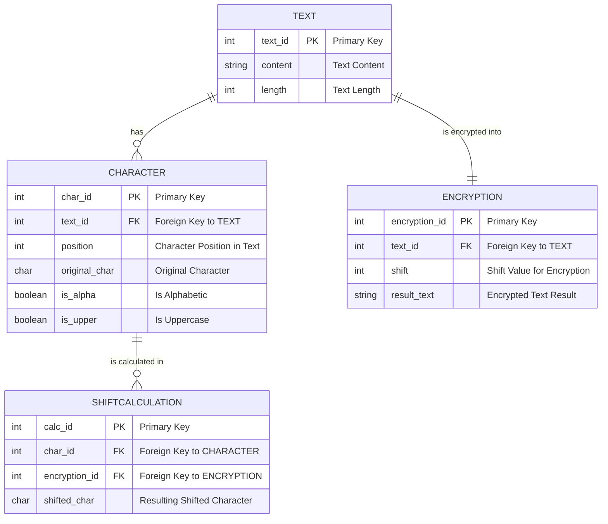

# Basic C++ Caesar Cipher
**Extremely easy to code, and even easier to crack.**
- Meant to be able to be sent through text, e-mail, files, and everything else.
- Can be encoded easily anywhere, anytime.
- Completely unsecure. **Can be cracked with a pencil and paper.**
## How it works:
By shifting the values of letters by a certain amoumt, a basic encryption is created.

**ABCDEFGHIJKLMNOPQRSTUVWXYZ → BCDEFGHIJKLMNOPQRSTUVWXYZA**
# 	Explaining the Code
> So far all we have is this fun flow chart!

